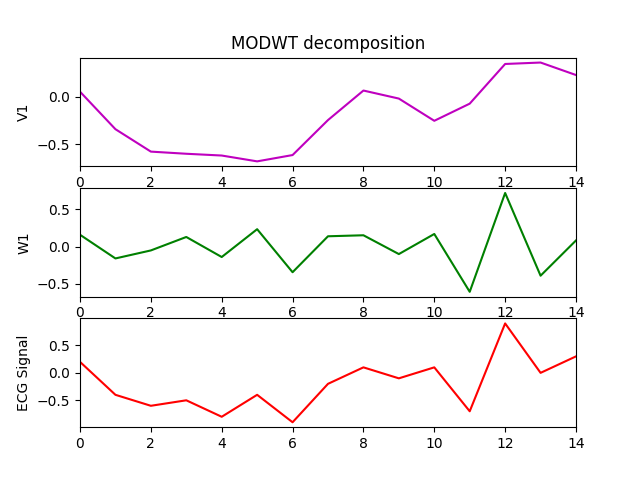
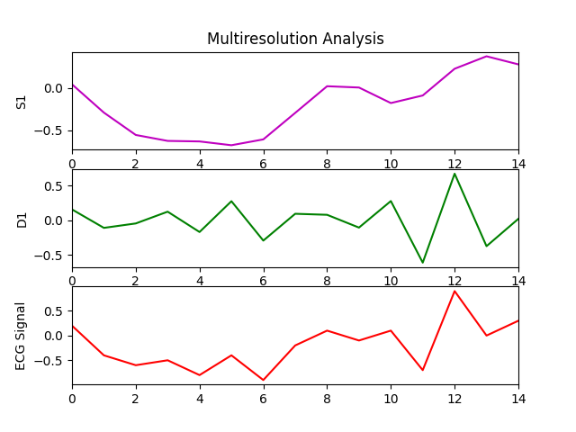

# MODWT-py
Implementation of Maximum Overlap Discrete Wavelet Transform in Python

## Introduction 
This implementation follows the pyramid Algorithm as described in [1]

## Considerations
### Choice of filters
Generally the choice of filters need to be balance between two considerations : 
- wavelets with very short width can introduce undiserable artefacts into the resulting analyses. 
- wavelet filters with large L can be better however more coefficients are influcend by boundary effect, more computationally expensive.

## Example

- Compute the MODWT 
```python
 test = [0.2, -0.4, -0.6, -0.5, -0.8, -0.4, -0.9, -0.2, 0.1, -0.1, 0.1, -0.7, 0.9, 0, 0.3]
 la8 = Filter('la8') # instantiate the filter
 
 m = MODWT( test, la8, 1) 	
 V, W = m.modwt()
 m.plot_modwt(V, W)
```



- Compute Multiresolution Analysis
```python
S, D = m.mra(V, W)
m.plot_mra(S,D)
```


## References
[1] Wavelet Methods for Time Series Analysis, Percival and Walden, 2000
